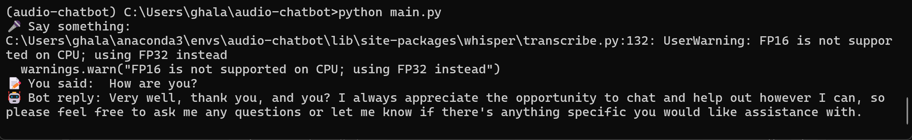

# Audio Chatbot using Whisper + Cohere + TTS

This project is an audio-based chatbot that records voice input, transcribes it using OpenAI’s Whisper, generates a text response via Cohere's large language model (LLM), and converts the reply to speech using pyttsx3.

---

## Features
- Voice input recording using microphone
- Transcription using Whisper
- Response generation using Cohere
- Text-to-Speech output using pyttsx3
- Saves input and response to `output_example.txt`

---

## Technologies Used
- Python 3.9
- Whisper – Speech-to-text
- Cohere – Large Language Model
- pyttsx3 – Text-to-Speech
- SpeechRecognition – Audio capture
- FFmpeg – Required by Whisper for audio decoding

---

## Installation

### 1. Clone the repository (or skip this step if files are already downloaded)

```bash
git clone https://github.com/YOUR_USERNAME/audio-chatbot.git
cd audio-chatbot
```

### 2. Create and activate a virtual environment

```bash
conda create --name audio-chatbot python=3.9
conda activate audio-chatbot
```

### 3. Install required Python packages

```bash
pip install -r requirements.txt
```

### 4. Install FFmpeg (if not already installed)

```bash
conda install -c conda-forge ffmpeg
```

---

## Setup

Replace the placeholder API key in `main.py` with your Cohere API key:

```python
co = cohere.Client("YOUR_API_KEY")
```

You can get your key from:  
https://dashboard.cohere.com/api-keys

---

## Usage

To start the chatbot, run:

```bash
python main.py
```

Then:
- Speak when prompted
- The bot will transcribe your voice, generate a reply, and read it aloud
- The full interaction will be saved to `output_example.txt`

---

## Demo

Below is a screenshot of the program in action:




---

## Project Structure

```
audio-chatbot/
├── main.py               # Main script
├── requirements.txt      # Python dependencies
├── screenshot.png        # Screenshot of working program
```

---

## Notes

- This project is intended for educational purposes
- Tested in Anaconda with Python 3.9 on Windows
